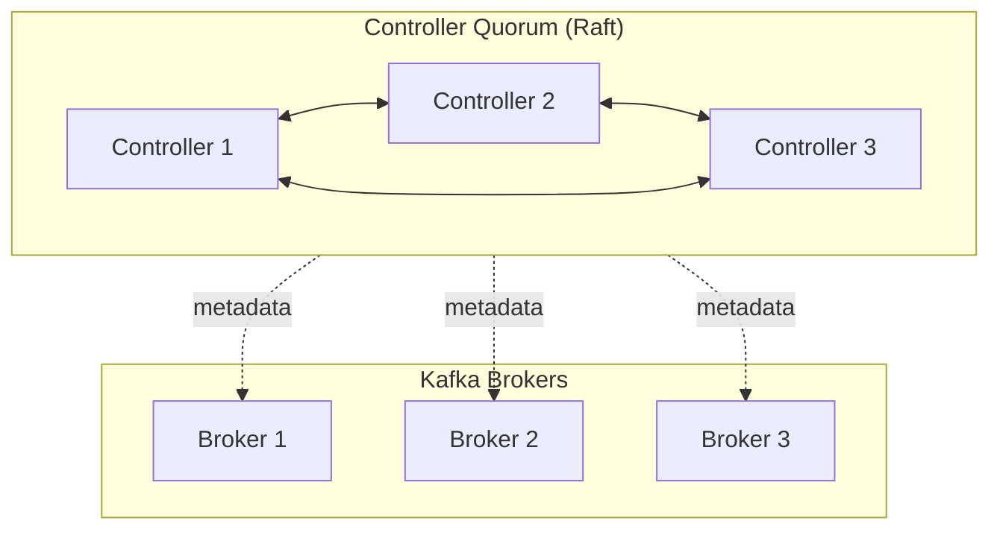

# 02 - KRaft (Kafka without ZooKeeper)

## What is KRaft?

**KRaft** stands for **Kafka Raft Metadata mode**. It replaces ZooKeeper by managing Kafka cluster metadata **inside Kafka** using a Raft-based **controller quorum**.

**In simple terms:** **KRaft = Kafka without ZooKeeper**.

---

## Why Kafka replaced ZooKeeper

ZooKeeper worked for years but created challenges:
- Operational overhead (running a separate ZK ensemble)
- Metadata scalability bottlenecks at very high partition counts
- Controller failover complexity (single controller bottleneck)
- Desire for simpler, unified architecture

---

## Kafka versions timeline (KRaft adoption)

- **2.8.0 (Apr 2021)**: KRaft introduced as preview/early access.
- **3.0 → 3.3**: stability improved.
- **3.4**: KRaft considered production-ready for most use cases.
- **3.7 (Feb 2024)**: ZooKeeper mode removed; KRaft becomes required.

> Vendor distributions may differ; validate your exact platform’s lifecycle.

---

## How KRaft works internally

### Main concepts
- **Controller Quorum**: 3–5 nodes recommended; stores metadata.
- **Metadata Log**: every metadata change is appended to a replicated log.
- **Leader Controller**: one leader + followers; Raft elects new leader on failure.
- **Brokers**: store partition data; they query the controllers for metadata.

### Metadata flow example (topic creation)
1. Client sends request to broker.
2. Broker forwards metadata change to controller leader.
3. Leader writes change to metadata log.
4. Followers replicate; Raft commits change.
5. Brokers learn updated metadata.

---

## Required KRaft settings (core)

```properties
process.roles=broker,controller
node.id=1
controller.quorum.voters=1@node1:9093,2@node2:9093,3@node3:9093

listeners=PLAINTEXT://:9092,CONTROLLER://:9093
listener.security.protocol.map=CONTROLLER:PLAINTEXT,PLAINTEXT:PLAINTEXT
controller.listener.names=CONTROLLER
```

### Cluster ID & storage formatting

```bash
kafka-storage.sh random-uuid
kafka-storage.sh format -t <clusterId> -c server.properties
```

---

## KRaft configuration examples

### Single-node (dev/local)

```properties
process.roles=broker,controller
node.id=1

listeners=PLAINTEXT://:9092,CONTROLLER://:9093
listener.security.protocol.map=CONTROLLER:PLAINTEXT,PLAINTEXT:PLAINTEXT
controller.listener.names=CONTROLLER

controller.quorum.voters=1@localhost:9093
```

### Multi-node (3 controller nodes)

Controller node config:

```properties
process.roles=controller
node.id=1  # unique per node

listeners=CONTROLLER://:9093
listener.security.protocol.map=CONTROLLER:PLAINTEXT
controller.listener.names=CONTROLLER

controller.quorum.voters=1@node1:9093,2@node2:9093,3@node3:9093
```

### Separate broker nodes

```properties
process.roles=broker
node.id=10  # unique per broker

listeners=PLAINTEXT://:9092
controller.listener.names=CONTROLLER
controller.quorum.voters=1@node1:9093,2@node2:9093,3@node3:9093
```

---

## Multi-cluster with KRaft

Kafka clusters are **independent**. You cannot “merge” clusters across data centers into one logical cluster.

### What is supported
- Run separate clusters per DC.
- Replicate data **between clusters** using:
  - **MirrorMaker 2**
  - **Cluster Linking** (Confluent)

### What is not supported
- A single stretched Kafka cluster across multiple DCs with partitions split across DCs.

---

## Diagram: KRaft controller quorum + brokers



Short answer: **They can do both.**
The nodes participating in the **KRaft controller quorum can also act as regular Kafka brokers**, unless you explicitly configure them to be *controller-only*.

---

## ✔️ **Detailed Explanation**

In KRaft mode (Kafka without ZooKeeper), you can run brokers in three possible roles:

### **1. Controller-only node**

* Runs only the KRaft controller process
* Does **not** store or serve Kafka partitions
* Does **not** handle producer/consumer traffic
  You choose this if you want a clean separation of responsibilities.

### **2. Broker-only node**

* Runs only broker functionality
* Does **not** participate in metadata quorum

### **3. Combined Controller + Broker node (most common)**

* Runs as part of the KRaft metadata quorum **and** acts as a broker
* Stores partitions, handles producers/consumers, and participates as a controller

This is the **default and recommended** mode for small–medium clusters.

---

## ✔️ **Example**

You have:

* **5 Kafka nodes**
* **3 nodes configured as KRaft controller quorum**

**These 3 can absolutely also function as brokers** (unless configured otherwise via `process.roles= controller`).

Typical config for combined roles:

```
process.roles=broker,controller
```

If you wanted them to be controller-only:

```
process.roles=controller
```

---

## ✔️ Best Practices

### For small clusters (< 9 nodes)

* Run **combined controller+broker** nodes
* Your setup (3 controllers + 2 broker-only nodes) is very common

### For large production clusters

* Use **dedicated controller nodes** for better metadata stability
* E.g., 3 controller-only + N broker-only nodes

---

## ✔️ Summary

| Node Type       | Participates in KRaft Quorum | Handles Producer/Consumer Traffic | Stores Partitions |
| --------------- | ---------------------------- | --------------------------------- | ----------------- |
| Controller-only | ✔️ Yes                       | ❌ No                              | ❌ No              |
| Broker-only     | ❌ No                         | ✔️ Yes                            | ✔️ Yes            |
| Combined        | ✔️ Yes                       | ✔️ Yes                            | ✔️ Yes            |

Your 3 controllers **can also contribute to messaging**, as long as you configure them as combined nodes.

---
