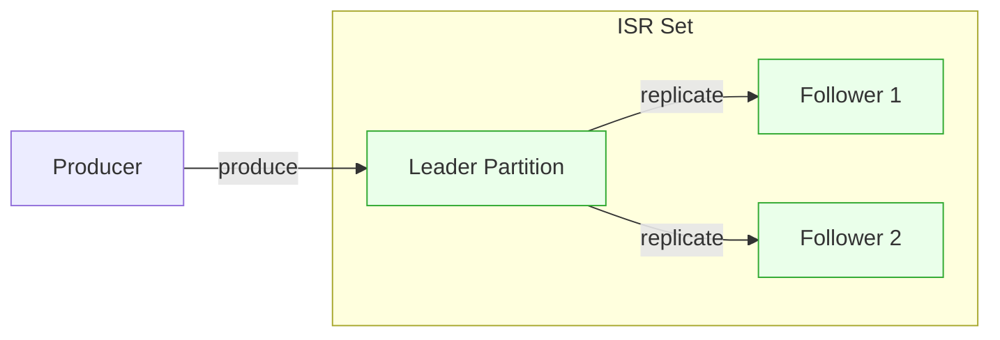
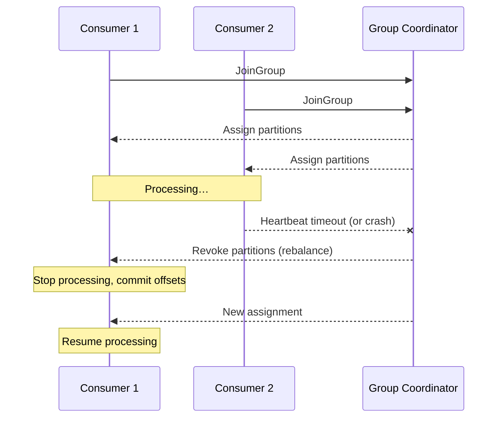

# 03 — Core Mechanics (Replication, acks, ordering, offsets, rebalance)

## Replication & ISR

Replication provides durability and availability.

### Key concepts
- **Replication Factor (RF)**: number of replicas per partition.
- **Leader**: handles reads/writes.
- **Followers**: replicate from leader.
- **ISR (In-Sync Replicas)**: replicas sufficiently caught up; only ISR can be leader candidates.

### Safety baseline
- `acks=all`
- `min.insync.replicas=2` (typical production)
- RF=3 (tolerate 1 broker failure)

---

## Replication defaults and small clusters

- `replication-factor <= number of brokers`

### 1 broker
- RF effectively 1 → no HA (dev-only).

### 2 brokers
- RF max 2 → limited HA.

### 3+ brokers
- RF=3 recommended for production baseline.

---

## Producer acks

`acks` controls durability vs throughput:

- `acks=0`: no wait (fastest, can lose data)
- `acks=1`: leader-only (balanced)
- `acks=all/-1`: wait for all ISR (strongest durability)

Recommended baseline:

```properties
acks=all
min.insync.replicas=2
# topic replication factor ideally 3
```

---

## Ordering guarantees

Kafka guarantees ordering **only within a partition**.

### How to preserve ordering by entity
- Use a stable key (`account_id`, `user_id`) so related messages go to the same partition.

### If global ordering is needed
- Single partition (not scalable) **or** sequence numbers + reorder in consumer.

---

## Offset management

**Offset** = record position in a partition.

### Storage
Offsets are stored in internal topic: `__consumer_offsets` (Kafka >= 0.9).

### Commit strategies
- Auto-commit (simple but can cause loss/duplicates)
- Manual commit sync
- Manual commit async
- Per-record commit (most control, slowest)

### `auto.offset.reset`
- `earliest`, `latest`, `none`

### Common failure modes
- **Duplicates**: crash after processing but before commit.
- **Loss**: commit before processing.

---

## Rebalance

A **rebalance** redistributes partitions across consumers in a group.

### When it happens
- consumer joins/leaves/crashes
- heartbeat timeouts
- partitions added

### Impact
- stop-the-world pause
- duplicates around commit boundaries

### Minimizing impact

```properties
session.timeout.ms=30000
heartbeat.interval.ms=3000
max.poll.interval.ms=300000

group.instance.id=consumer-1
partition.assignment.strategy=CooperativeStickyAssignor
```

---

## Diagram: Replication leader/follower + ISR



---

## Diagram: Rebalance “stop the world”


