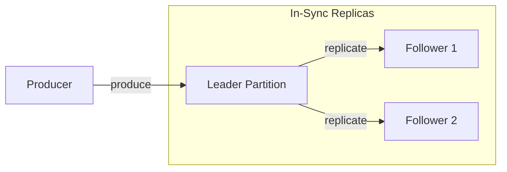
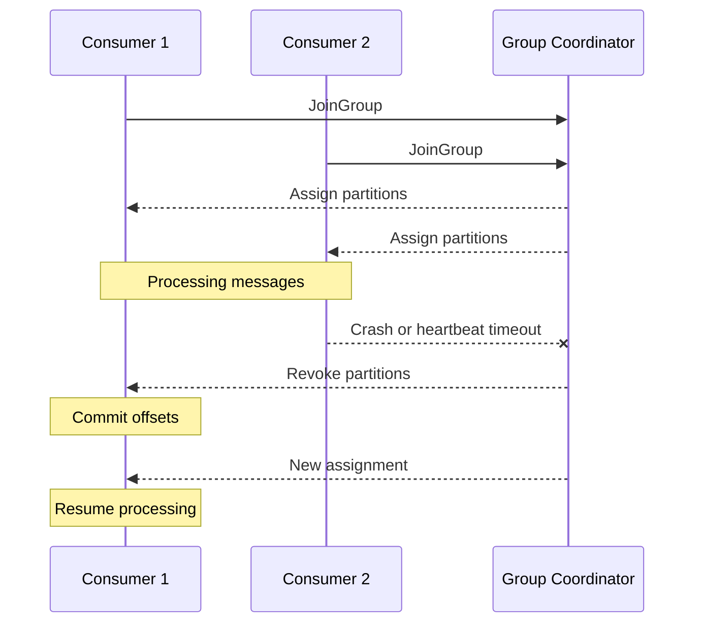

# 03 - Core Mechanics (Replication, Acks, Ordering, Offsets, Rebalancing)

This section explains some of the core mechanics that make **Apache Kafka** reliable and scalable. Understanding these concepts helps when designing systems that use Kafka in production.

---

# Replication and ISR

Kafka keeps multiple copies of data so it can survive broker failures. This is called **replication**.

Each **partition** of a topic is stored on multiple brokers.

### Important terms

* **Replication Factor (RF)**
  The number of copies of a partition stored across brokers.

* **Leader**
  The replica that handles all reads and writes for a partition.

* **Followers**
  Replicas that copy data from the leader.

* **ISR (In-Sync Replicas)**
  Replicas that are caught up with the leader and safe to become the next leader if needed.

If the leader fails, Kafka chooses a new leader from the **ISR set**.

---

## Typical production setup

A common production configuration looks like this:

```properties
replication.factor=3
min.insync.replicas=2
acks=all
```

This means:

* each partition has **3 copies**
* at least **2 replicas must confirm the write**
* the system can **survive one broker failure**

---

# Replication in Small Clusters

Replication depends on how many brokers exist in the cluster.

## 1 Broker

Replication factor is effectively **1**.

* no redundancy
* data loss if the broker crashes

This setup is fine only for **local development**.

---

## 2 Brokers

Replication factor can be **2**.

This gives some redundancy, but it is still not ideal for production.

---

## 3 or More Brokers

Replication factor **3** is the usual production baseline.

Benefits:

* tolerate one broker failure
* good balance between durability and cost

---

# Producer Acknowledgements (acks)

When a producer sends a message, it waits for confirmation from Kafka.
The **acks** setting controls how strict this confirmation is.

### acks=0

The producer sends the message and does **not wait for any response**.

* fastest
* highest risk of data loss

---

### acks=1

The producer waits for the **leader** to confirm the write.

* decent performance
* data can still be lost if the leader fails before followers replicate

---

### acks=all (or -1)

The producer waits until **all replicas in the ISR** confirm the write.

* strongest durability
* slightly slower

Recommended configuration:

```properties
acks=all
min.insync.replicas=2
```

---

# Ordering Guarantees

Kafka guarantees ordering **within a single partition**.

Messages written to the same partition will always be read in the same order.

---

## Keeping related messages ordered

If events belong to the same entity (for example a user or account), use a **stable key**.

Examples:

```
user_id
account_id
order_id
```

Kafka hashes the key and sends those messages to the same partition.

This keeps events for that entity in the correct order.

---

## What about global ordering?

Kafka does **not guarantee ordering across partitions**.

If strict global ordering is required, there are two options:

1. Use **one partition** (limits scalability)
2. Add **sequence numbers** and reorder messages in the consumer

Most systems avoid global ordering because it reduces throughput.

---

# Offsets

An **offset** is the position of a record inside a partition.

Example:

```
Partition 0

Offset: 0 1 2 3 4 5
```

Consumers track offsets so they know which messages were already processed.

---

## Where offsets are stored

Kafka stores consumer offsets in an internal topic:

```
__consumer_offsets
```

Kafka uses this topic to track progress for each **consumer group**.

---

# Offset Commit Strategies

Consumers periodically **commit offsets** to mark messages as processed.

### Auto commit

Kafka automatically commits offsets at a fixed interval.

* easiest setup
* can lead to duplicates or skipped messages

---

### Manual commit

The consumer commits offsets manually after processing messages.

Two common approaches:

* **commitSync()** – safer but slower
* **commitAsync()** – faster but less strict

---

# Common Failure Situations

### Duplicate messages

This can happen if:

```
process message
application crashes
offset was not committed yet
```

When the consumer restarts, it processes the message again.

---

### Message loss

This can happen if:

```
offset committed
application crashes
message processing not finished
```

The message will be skipped.

Because of this, many systems are designed to be **idempotent** (safe to process messages multiple times).

---

# Consumer Rebalancing

Consumers usually run in **groups**.
Kafka distributes partitions across the consumers in the group.

A **rebalance** happens when Kafka needs to redistribute partitions.

---

## When rebalancing happens

Common triggers:

* a consumer joins the group
* a consumer crashes
* a consumer stops sending heartbeats
* the number of partitions changes

---

## What happens during a rebalance

During a rebalance:

1. consumers stop processing
2. partitions are revoked
3. Kafka assigns partitions again
4. consumers resume processing

This short pause can sometimes lead to duplicate processing.

---

## Reducing rebalance impact

Some configuration options help reduce disruption:

```properties
session.timeout.ms=30000
heartbeat.interval.ms=3000
max.poll.interval.ms=300000
```

Kafka also supports **cooperative rebalancing**, which moves partitions gradually instead of stopping all consumers at once.

---

# Replication Diagram

This diagram shows a leader and follower replicas.



The replicas inside the **ISR set** are caught up with the leader and can take over if the leader fails.

---

# Rebalance Example

This diagram shows what happens when a consumer crashes.



---

These mechanics — replication, acknowledgements, ordering, offsets, and rebalancing — form the foundation of how Kafka processes data reliably in distributed systems.
