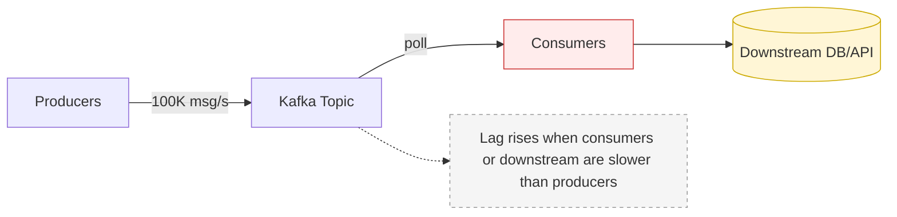

# 04 - Performance & Optimization (Producer/Consumer, Backpressure, Zero-copy, Message size)

## Producer throughput tuning

Key levers:
- **Batching**: `linger.ms`, `batch.size`, `buffer.memory`
- **Compression**: snappy/lz4/gzip/zstd
- **Async sends** (callbacks)
- **Idempotence**: safe retries with deduplication
- **Partitioning**: avoid hot partitions
- **Scale out**: multiple producers/threads where appropriate

Example baseline config (illustrative):

```properties
linger.ms=10
batch.size=65536
buffer.memory=134217728
compression.type=lz4

enable.idempotence=true
acks=all
retries=2147483647
max.in.flight.requests.per.connection=5
```

Monitor:
- record-send-rate, record-error-rate
- request-latency-avg
- batch-size-avg
- buffer-available-bytes

---

## Consumer throughput tuning

Key levers:
- **More partitions** → more parallelism
- **Fetch tuning**: `fetch.min.bytes`, `fetch.max.wait.ms`, `max.partition.fetch.bytes`
- **Poll tuning**: `max.poll.records` and poll duration
- **Parallel processing** (careful with ordering and commits)
- **Avoid rebalances**: timeouts, static membership, cooperative assignor
- **Manual commits** after processing

Illustrative config:

```properties
enable.auto.commit=false
max.poll.records=1000
fetch.min.bytes=1048576
fetch.max.wait.ms=500
max.partition.fetch.bytes=10485760
session.timeout.ms=30000
max.poll.interval.ms=300000
```

---

## Backpressure handling

Backpressure = consumers can’t keep up with producers.

### Detect
- rising consumer lag
- high consumer CPU/memory
- slow downstream APIs/DB

### Mitigate
- scale consumers horizontally
- increase partitions
- batch downstream writes
- rate limit producers
- circuit breakers
- pause/resume
- DLQ for poison messages
- broker quotas
- tiered storage (Confluent) for older segments

---

## Zero-copy

Kafka can use **zero-copy** to send data from disk to network without copying into app buffers, reducing CPU and memory overhead.

When zero-copy may not apply:
- SSL/TLS
- transformations that require decompression/recompression

---

## Message size limits & best practices

Kafka enforces size limits across layers:
- Broker: `message.max.bytes`
- Topic: `max.message.bytes`
- Producer: `max.request.size`
- Consumer: `fetch.max.bytes`, `max.partition.fetch.bytes`

### Guidelines
- Keep events **< 1MB** when possible.
- For large payloads: store in object storage (S3/Blob/GCS) and publish a **reference** (URL, checksum, metadata) to Kafka.

### If larger messages are unavoidable
Tune broker/topic/producer/consumer together:

```properties
# Broker
message.max.bytes=20000000
replica.fetch.max.bytes=20000000

# Topic
max.message.bytes=20000000

# Producer
max.request.size=20000000

# Consumer
max.partition.fetch.bytes=20000000
fetch.max.bytes=20000000
```

---

## Diagram: Backpressure & scaling pattern


