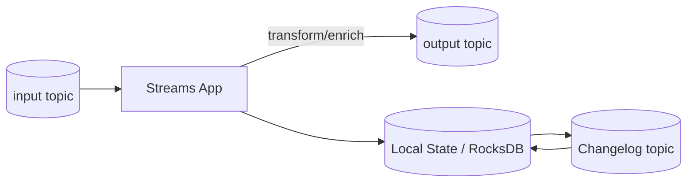

# 05 - Kafka Streams & ksqlDB

## Kafka Streams (what and why)

Kafka Streams is a **Java library** for building stream-processing apps on Kafka.

### Key characteristics
- No separate cluster required (runs as an application)
- Supports stateless and stateful processing
- State stored locally (RocksDB) + backed by Kafka changelog topics
- Can run with **exactly-once semantics**

### When to use
- real-time transformation (map/filter)
- aggregations, joins, windowing
- event-driven microservices

### When not to use
- batch processing → Spark
- want SQL-first approach → ksqlDB
- multi-source processing beyond Kafka → Flink

---

## ksqlDB (how it differs)

ksqlDB is a **SQL engine/server** built on Kafka Streams.

### Differences (conceptual)
- Kafka Streams: embedded library, Java/Scala API
- ksqlDB: server with SQL + REST interface

### Use ksqlDB for
- rapid prototyping
- streaming analytics with SQL
- interactive queries & materialized views

---

## Exactly-once note (Streams)

Kafka Streams can enable EOS with:

```properties
processing.guarantee=exactly_once_v2
```

---

## Diagram: Streams app topology (high-level)



---

## Mini example (concept)

```java
KStream<String, String> orders = builder.stream("orders");
KTable<String, Long> counts = orders.groupByKey().count();
counts.toStream().to("order_counts");
```
