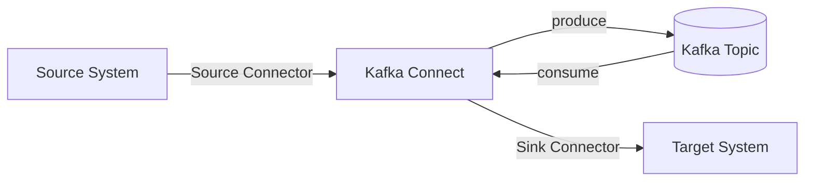

# 06 - Kafka Connect, Retries/Backoff, and DLQ

## Kafka Connect (what it is)

Kafka Connect is a **separate service/runtime** for moving data **into** and **out of** Kafka.

- **Source connectors**: external system → Kafka
- **Sink connectors**: Kafka → external system

Connect is not a broker and does not store Kafka topic data.

---

## Pre-built vs custom connectors

### Pre-built connectors
Most integrations are solved using ready-made connectors (Confluent Hub / OSS):
- JDBC, Debezium (CDC)
- S3 / object storage
- Elasticsearch
- Snowflake
- MongoDB
- Salesforce

### Custom connectors
Write custom connectors when:
- no existing connector fits
- proprietary systems require custom logic

You implement:
- `SourceConnector` + `SourceTask`
- `SinkConnector` + `SinkTask`

---

## Retries, backoff, DLQ: what’s native and what isn’t

### Apache Kafka broker (open source)
- Brokers do **not** do application-level retry count/backoff/DLQ routing.
- These patterns are implemented by:
  - producer/consumer code
  - Kafka Streams app
  - Kafka Connect connector error handling

### Kafka Connect error handling (connector-level)

```properties
errors.tolerance=all
errors.deadletterqueue.topic.name=dlq-topic
errors.deadletterqueue.context.headers.enable=true
errors.retry.timeout=60000
errors.retry.delay.max.ms=5000
```

Notes:
- This applies to **connectors**, not generic consumers.

---

## Diagram: Where Connect sits



---

## Practical DLQ pattern (application-level)

When not using Connect/Streams, typical pattern:
- main topic → retry topic(s) (with delay) → DLQ topic
- or use a separate consumer that re-publishes failed events

> Kafka itself won’t schedule delayed retries; delay is implemented in the application or by time-based topics.
