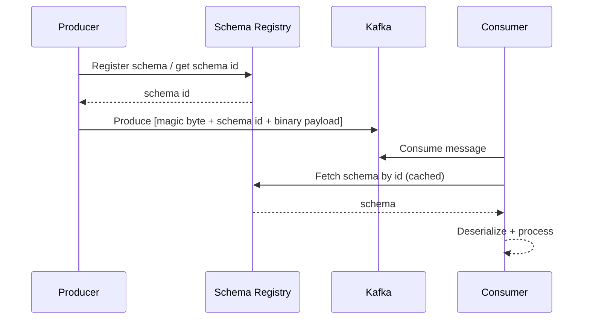

# 07 - Schema Registry & Schema Evolution

## Why Schema Registry is critical

Schema Registry provides a centralized way to:
- manage schemas for topics
- enforce compatibility rules
- enable safe schema evolution across many producers/consumers
- reduce message size (schema id + binary payload)
- improve type safety

---

## Supported formats
- Avro
- Protobuf
- JSON Schema

---

## Compatibility modes
- BACKWARD
- FORWARD
- FULL
- NONE
- Transitive variants: BACKWARD_TRANSITIVE, FORWARD_TRANSITIVE, FULL_TRANSITIVE

### Safe evolution patterns
- Add optional fields with defaults
- Avoid removing required fields
- Avoid type changes (string → int, etc.)
- Avoid rename without alias/support

### Handling breaking changes
If breaking change is unavoidable:
1. Create new topic (e.g., `users-v2`)
2. Dual-write temporarily
3. Migrate consumers
4. Deprecate old topic

---

## Diagram: Registry workflow



---

## REST API examples (illustrative)

Register schema:

```bash
curl -X POST http://localhost:8081/subjects/users-value/versions \
  -H "Content-Type: application/vnd.schemaregistry.v1+json" \
  -d '{"schema": "{...}"}'
```

Check compatibility:

```bash
curl -X POST http://localhost:8081/compatibility/subjects/users-value/versions/latest \
  -H "Content-Type: application/vnd.schemaregistry.v1+json" \
  -d '{"schema": "{...new schema...}"}'
```
