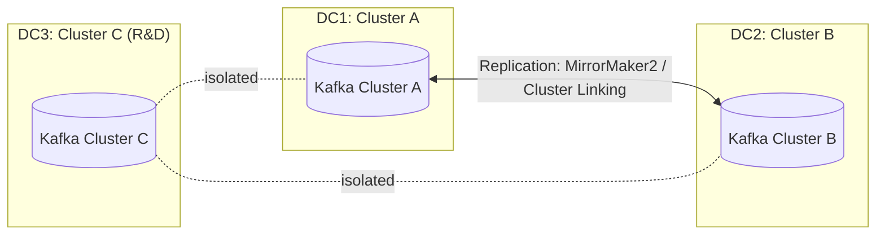

# 08 - Ops: Monitoring & Troubleshooting

## Monitoring Kafka cluster health

Monitor at multiple layers:

### Broker metrics (critical)
- UnderReplicatedPartitions (alert if > 0)
- OfflinePartitionsCount (alert immediately)
- ActiveControllerCount (should be 1)
- ISR shrinks/expands rate
- Request handler/network idle percent
- Request queue size

### Topic/partition metrics
- Log size growth
- Replica lag
- Log end offsets

### Producer metrics
- record-send-rate
- record-error-rate
- request-latency-avg
- buffer-available-bytes

### Consumer metrics (most important)
- consumer lag (records-lag-max)
- records-consumed-rate
- fetch-latency-avg
- commit-latency-avg

### Host/system metrics
- CPU, disk I/O (iowait), network throughput
- memory/page cache (avoid swapping)
- file descriptors

### Tooling
- JMX + Prometheus/Grafana
- Confluent Control Center
- Burrow (consumer lag monitoring)

---

## Troubleshooting: High consumer lag

### Step 1 — quantify lag

```bash
kafka-consumer-groups.sh --bootstrap-server <broker:9092> \
  --describe --group <group-id>
```

### Step 2 — common causes and fixes

#### A) Slow consumer processing
- profile code
- batch downstream calls
- scale consumers

#### B) Partition imbalance / data skew
- fix partition key
- add partitions

#### C) Downstream bottleneck (DB/API)
- scale downstream
- circuit breaker
- async processing

#### D) Rebalance churn
- tune `session.timeout.ms`, `max.poll.interval.ms`
- use `group.instance.id`
- use `CooperativeStickyAssignor`

#### E) Network issues
- check bandwidth/latency
- increase timeouts
- co-locate consumers with brokers

#### F) Too few partitions
- increase partition count to unlock parallelism

### Step 3 — monitor while fixing

```bash
watch -n 1 'kafka-consumer-groups.sh --bootstrap-server <broker:9092> --describe --group <group-id>'
```

### Step 4 — prevent recurrence
- capacity planning
- lag-based autoscaling
- proactive alerting

Emergency measures (use carefully):
- pause non-critical consumers
- scale up aggressively
- skip to latest only if acceptable

---

## Diagram: Multi-DC (independent clusters + replication)



---

## Alerting strategy (practical)

**Page immediately**
- OfflinePartitionsCount > 0
- UnderReplicatedPartitions > 0
- ActiveControllerCount != 1
- Consumer lag exceeds critical threshold

**Investigate during business hours**
- increasing request latency
- disk usage > 80%
- sustained CPU > 80%
- ISR shrink rate elevated
